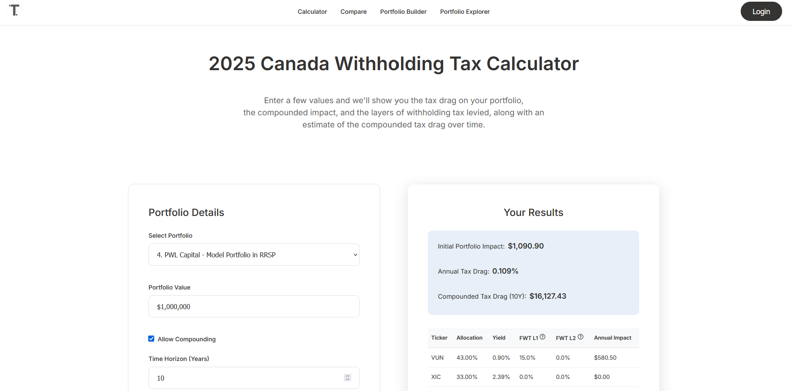
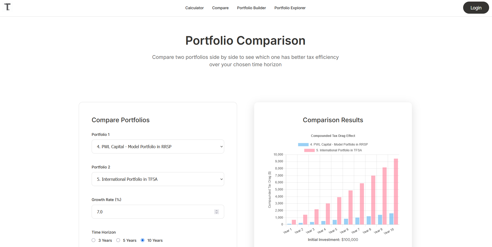

# Hi, I'm Abu 👋  

I’m a Computer Science student at Thompson Rivers University with experience in **full-stack web development, cloud computing, and data-driven applications**.  
I enjoy building tools that simplify complex problems — especially in **finance and investing technology**.  

---

## Featured Project: TaxDrag.ca  
Canada’s first all-in-one **Foreign Withholding Tax Calculator** designed to help investors thousands by understanding the ecct of tax drags on their portfolio!.  

## 🛠️ Tech & Tools  
- **Languages**: Java, Python, JavaScript, SQL, PHP, R, MATLAB  
- **Web Development**: HTML5, CSS3, jQuery, Chart.js, WordPress  
- **Cloud & Tools**: AWS (EC2), Git, Node.js  
- 📊 **Features**:  
  - Portfolio Builder (custom user + anonymous portfolios)  
  - Tax drag comparison across account types (RRSP, TFSA, Non-Registered)  
  - Prebuilt portfolios (e.g., PWL Capital’s Model Portfolio)  

👉 [Visit TaxDrag.ca](https://taxdrag.ca)  

### Screenshots  
#### Homepage Calculation  
  

#### Compare Portfolios  
  

---
## Project: Conway’s Game of Life – Image-Based Cellular Automata Art  

Creative exploration of **cellular automata**, where each pixel in an image evolves over time following **Conway’s Game of Life** rules.  
The project blends computation and art — transforming static BMP images into dynamic, color-evolving patterns through algorithmic simulation, built with Pyhon & Pygame.  

🔗 [View on GitHub](README.md)

---

## 🌱 Currently Learning  
- Spring Boot for backend APIs  
- Scikit Learn & cloud deployments  
