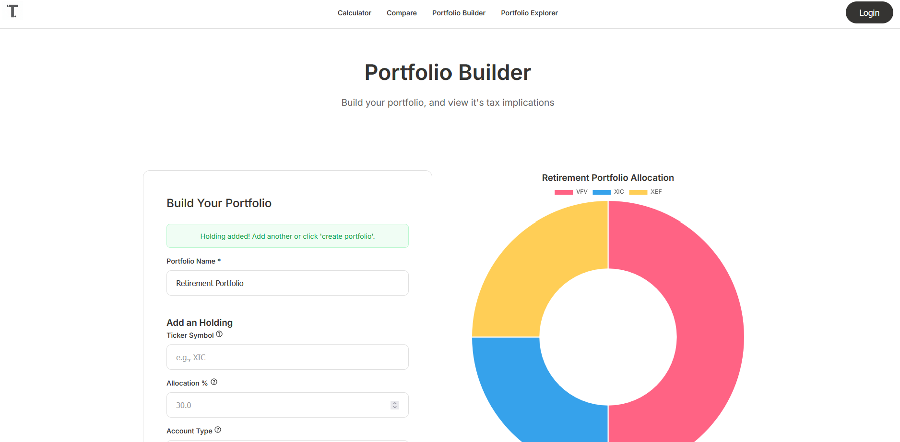

# Hi, I'm Abu 👋  

I’m a Computer Science student at Thompson Rivers University with experience in **full-stack web development, cloud computing, and data-driven applications**.  
I enjoy building tools that simplify complex problems — especially in **finance and investing technology**.  

---

## Featured Project: TaxDrag.ca  
Canada’s first all-in-one **Foreign Withholding Tax Calculator** designed to help investors understand tax drag in ETF portfolios.  

- 🔧 **Tech stack**: PHP, MySQL, JavaScript, Chart.js, UUID, MVC  
- 📊 **Features**:  
  - Portfolio Builder (custom user + anonymous portfolios)  
  - Tax drag comparison across account types (RRSP, TFSA, Non-Registered)  
  - Prebuilt portfolios (e.g., PWL Capital’s Model Portfolio)  

👉 [Visit TaxDrag.ca](https://taxdrag.ca)  

### Screenshots  
#### Homepage Calculation  
  

#### Compare Portfolios  
  

#### Portfolio Builder  
  

---

## 🛠️ Tech & Tools  
- **Languages**: Java, Python, JavaScript, SQL, PHP, R, MATLAB  
- **Web Development**: HTML5, CSS3, jQuery, Chart.js, WordPress  
- **Cloud & Tools**: AWS (EC2), Git, Node.js  

---

## 🌱 Currently Learning  
- Spring Boot for backend APIs  
- Scikit Learn & cloud deployments  
