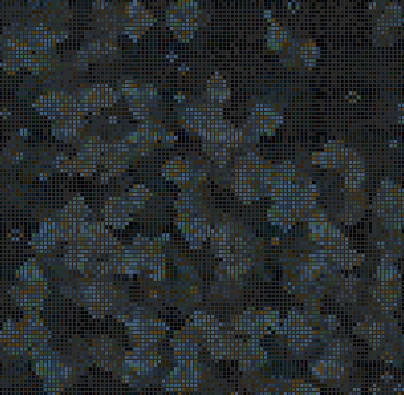

# Hi, I'm Abu

I’m a Computer Science student at Thompson Rivers University with experience in **full-stack web development, cloud computing, and data-driven applications**.  
I enjoy building tools that simplify complex problems — especially for **finance and and property management **.  

Languages: PHP, JavaScript, Python, Java, SQL, HTML5, CSS3

Frameworks & Tools: Node.js, Spring Boot, AWS, Chart.js, jQuery

---
## Featured Project: TaxDrag.ca  
Canada’s first all-in-one **Foreign Withholding Tax Calculator** designed to help investors **thousands** by understanding the effects of this sneaky tax on their portfolio! By allowing users to calculate and compare Foreign Withholding Taxes across several popular portfolios, it allows DIY investors to make an more educated financial decision.

[Visit TaxDrag.ca](https://taxdrag.ca)  

#### Calculator 
  

#### Compare Portfolios  
  

## Tech & Tools  
- **Languages**: JavaScript, SQL
- **Web Development**: HTML5, CSS3, jQuery, Chart.js, MVC Architecture 
---
## Conway’s Game of Life – Image-Based Cellular Automata Art  

Creative exploration of **cellular automata**, where each pixel in an image evolves over time following **Conway’s Game of Life** rules.  
The project blends computation and art — transforming static BMP images into dynamic, color-evolving patterns through cellular automata algorithm, built with Pyhon & Pygame.  

[Visit on GitHub](https://github.com/Abu-Sharif/conways-game-of-life-image-patterns)

  
---

## Currently Learning  
- Spring Boot for backend APIs  
- Scikit Learn for machine learning predications & cloud deployments  
